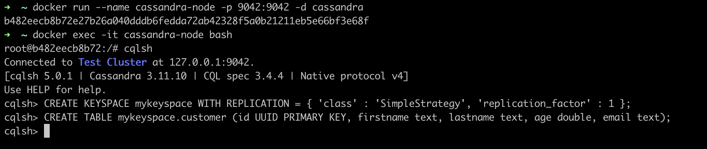
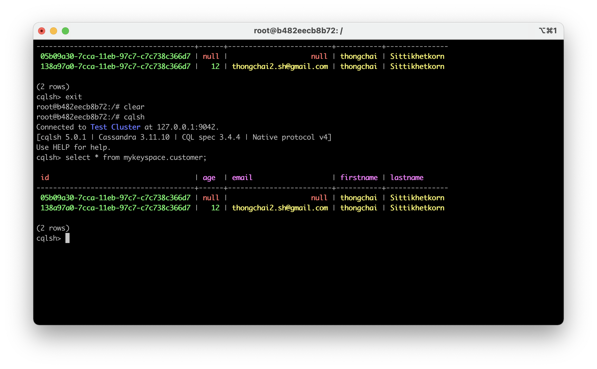

# สร้าง Microservice + Cassandra ด้วย Spring Boot + Spring Data
## Dependency
```xml
<dependency>
	<groupId>org.springframework.boot</groupId>
	<artifactId>spring-boot-starter-data-cassandra</artifactId>
</dependency>
```
## APIs
- GET /api/customers — เรียกดูรายการ Customer ทั้งหมด  
- GET /api/customers/{id} — เรียกดู Customer โดย user id  
- GET /api/customers?name=xxxx — เรียกดูรายการ Customer ด้วยการค้นหาด้วย name  
- POST /api/customers — สร้าง Customer ใหม่  
- PUT /api/customers/{id} — แก้ไข Customer โดย user id  
- DELETE /api/customers/{id} — ลบ Customer โดย user id

## Install 
```bash
docker run --name cassandra-node -p 9042:9042 -d cassandra
```
### Create database
```aidl
step 1 
docker exec -it cassandra-node bash
step 2 into CQL shell
cqlsh
step 3 create key space
CREATE KEYSPACE mykeyspace WITH REPLICATION = { 'class' : 'SimpleStrategy', 'replication_factor' : 1 };
step 4 create table
CREATE TABLE mykeyspace.customer (id UUID PRIMARY KEY, firstname text, lastname text, age double, email text);
```


## Test
```aidl
http://localhost:9001/api/customers
```
### Via Rest Client
```aidl
rest-client.http
```
### Via CQL shell
```aidl
cqlsh
select * from mykeyspace.customer;
```


## Reference
[สร้าง Microservice + Cassandra ด้วย Spring Boot + Spring Data](https://phayao.medium.com/%E0%B8%AA%E0%B8%A3%E0%B9%89%E0%B8%B2%E0%B8%87-microservice-cassandra-%E0%B8%94%E0%B9%89%E0%B8%A7%E0%B8%A2-spring-boot-spring-data-a28ec9cec3ba)