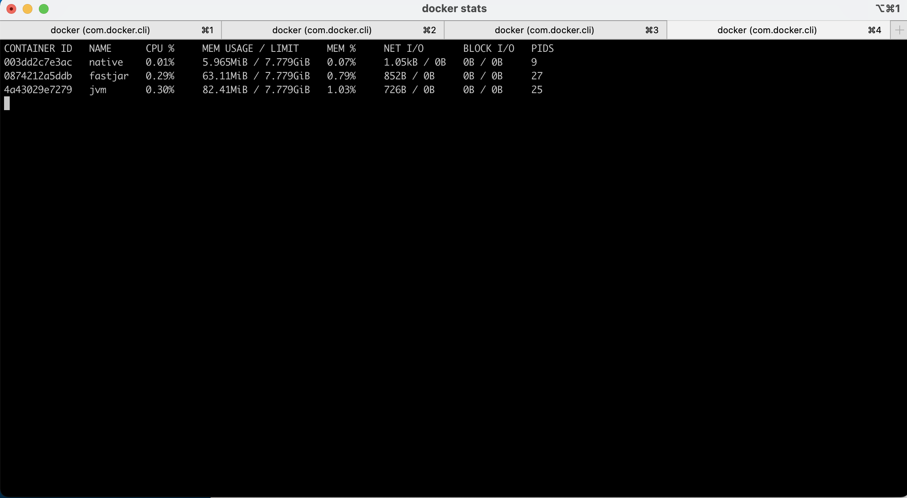

# code-with-quarkus project

This project uses Quarkus, the Supersonic Subatomic Java Framework.

If you want to learn more about Quarkus, please visit its website: https://quarkus.io/ .

## Running the application in dev mode

You can run your application in dev mode that enables live coding using:
```shell script
./mvnw compile quarkus:dev
```

## Packaging and running the application

The application can be packaged using:
```shell script
./mvnw package
```
It produces the `code-with-quarkus-1.0.0-SNAPSHOT-runner.jar` file in the `/target` directory.
Be aware that it’s not an _über-jar_ as the dependencies are copied into the `target/lib` directory.

If you want to build an _über-jar_, execute the following command:
```shell script
./mvnw package -Dquarkus.package.type=uber-jar
```

The application is now runnable using `java -jar target/code-with-quarkus-1.0.0-SNAPSHOT-runner.jar`.

## Creating a native executable

You can create a native executable using: 
```shell script
./mvnw package -Pnative
```

Or, if you don't have GraalVM installed, you can run the native executable build in a container using:


If you want to learn more about building native executables, please consult https://quarkus.io/guides/maven-tooling.html.

# RESTEasy JAX-RS

<p>A Hello World RESTEasy resource</p>

Guide: https://quarkus.io/guides/rest-json


# Warning !!!
## Must to set docker desktop memory first.


```shell script
./mvnw package -Pnative -Dquarkus.native.container-build=true -Dquarkus.native.native-image-xmx=5g
```
You can then execute your native executable with: `./target/code-with-quarkus-1.0.0-SNAPSHOT-runner`

## Run native with container
```
docker build -f src/main/docker/Dockerfile.native -t quarkus-quickstart/getting-started .
docker run -i --rm -p 8080:8080 quarkus-quickstart/getting-started
```

## Test it. !!!
```
http://localhost:8080/hello-resteasy
docker stats
```
## Result
```
docker run -i --name=native --rm -p 8082:8080 quarkus/code-with-quarkus
docker run -i --name=fastjar --rm -p 8081:8080 -p 5005:5005 -e JAVA_ENABLE_DEBUG="true" quarkus/code-with-quarkus-fast-jar
docker run -i --name=jvm --rm -p 8080:8080 quarkus/code-with-quarkus-jvm
```


