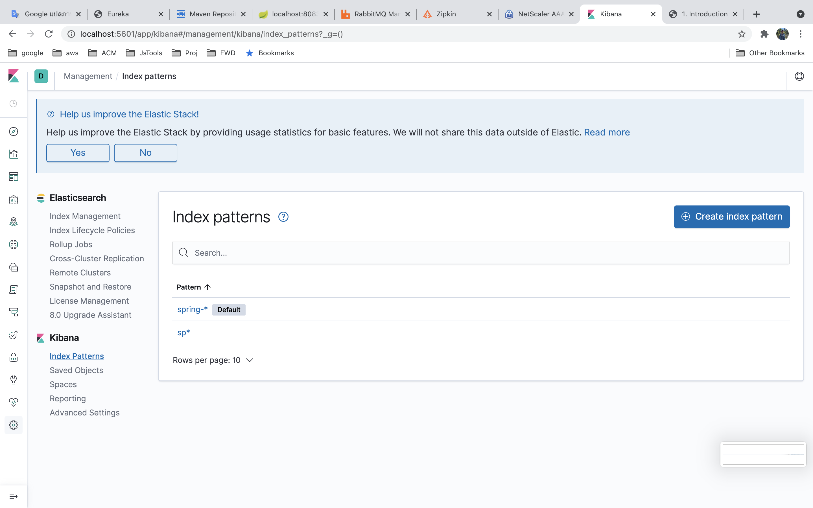

# Spring boot ELK Basic :smile:
## Description
- Elasticsearch [port:9200]
- Kibana [http://localhost:5601]
- Logstash [port:5044]

## Concept
-  Spring boot send logs via logback then push to logstash , logstash will be fillter condition and insert data to elsaticeseach ,Kibana for virtualization data

## Spring boot
### Add dependency
```xml
<dependency>
	<groupId>net.logstash.logback</groupId>
	<artifactId>logstash-logback-encoder</artifactId>
	<version>6.6</version>
</dependency>
<dependency>
	<groupId>ch.qos.logback</groupId>
	<artifactId>logback-classic</artifactId>
	<version>1.2.3</version>
</dependency>
```
- Config logback.xml
```xml
<?xml version="1.0" encoding="UTF-8"?>
<configuration debug="false">
    <include resource="org/springframework/boot/logging/logback/base.xml"/>
    <appender name="logstash" class="net.logstash.logback.appender.LogstashTcpSocketAppender">
        <destination>localhost:5044</destination>
        <encoder class="net.logstash.logback.encoder.LoggingEventCompositeJsonEncoder">
            <providers>
                <mdc/>
                <context/>
                <version/>
                <logLevel/>
                <loggerName/>
                <message/>
                <pattern>
                    <pattern>
                        {
                        "appName": "elk-product-service"
                        }
                    </pattern>
                </pattern>
                <threadName/>
                <stackTrace/>
            </providers>
        </encoder>
    </appender>
    <root level="INFO">
        <appender-ref ref="CONSOLE"/>
        <appender-ref ref="logstash"/>
    </root>
    <logger name="org.springframework" level="INFO"/>
    <logger name="com.example.product" level="INFO"/>
</configuration>
```
## Setup Index KIBANA
```
http://localhost:5601/app/kibana#/management/kibana/index_patterns?_g=()  
```
```
-Check API
http://localhost:9200/_cat/indices

```



## Run
``` 
start.sh or docker-compose up
```

**Product Service**  
http://localhost:8081/products  
**Price Service**  
http://localhost:8080/products/price  
**Kibana URL**  
http://localhost:5601/
## Reference
[สร้างระบบ Monitoring Microservices ด้วย Spring Cloud Sleuth, ELK, และ Zipkin](https://medium.com/linedevth/%E0%B8%AA%E0%B8%A3%E0%B9%89%E0%B8%B2%E0%B8%87%E0%B8%A3%E0%B8%B0%E0%B8%9A%E0%B8%9A-monitoring-microservices-%E0%B8%94%E0%B9%89%E0%B8%A7%E0%B8%A2-spring-cloud-sleuth-elk-%E0%B9%81%E0%B8%A5%E0%B8%B0-zipkin-284d1aca16b4)  

[Send the Logs of a Java App](https://www.baeldung.com/java-application-logs-to-elastic-stack)

[มาทำระบบ Monitoring ด้วย ELK กัน](https://medium.com/@benz20003/%E0%B8%A1%E0%B8%B2%E0%B8%97%E0%B8%B3%E0%B8%A3%E0%B8%B0%E0%B8%9A%E0%B8%9A-monitoring-%E0%B8%94%E0%B9%89%E0%B8%A7%E0%B8%A2-elk-%E0%B8%81%E0%B8%B1%E0%B8%99-70dcf19a38df)