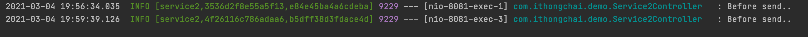
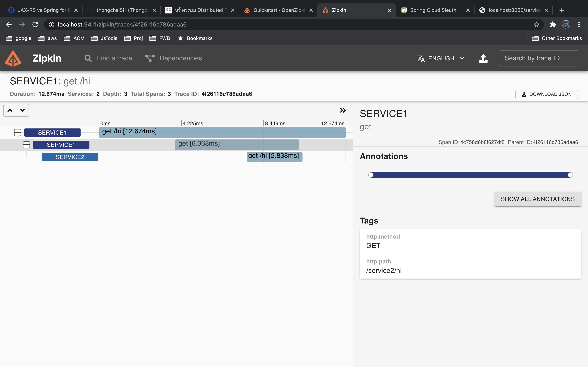

# Spring Zipkin (Distributed Tracing)
## [zipkin io](https://zipkin.io/)

## Install

### Dependency

```
<dependency>
	<groupId>org.springframework.cloud</groupId>
    <artifactId>spring-cloud-sleuth-zipkin</artifactId>
</dependency>

<dependency>
	<groupId>org.springframework.cloud</groupId>
	<artifactId>spring-cloud-starter-sleuth</artifactId>
</dependency>
```

### Zipkin server

```
docker run --name=zipkin-server -d -p 9411:9411 openzipkin/zipkin
```

## Runner
http://localhost:9411/zipkin/
http://localhost:8080/service1/hi
http://localhost:8081/service2/hi

## Summary
Spring Cloud Sleuth จะเพิ่ม information ดังนี้

- Application name จะ config ในไฟล์ spring.application.name
- Trace ID คือ correlation ID ซึ่งจะเป็น unique ใช้ส่งต่อไปกับ service อื่น
- Span ID เป็น unique ID ที่จะใช้ในแต่ละ service นั้นๆ 

## Tester
http://localhost:8080/service1/hi




## Reference
[สร้างระบบ Monitoring Microservices ด้วย Spring Cloud Sleuth, ELK, และ Zipkin](https://medium.com/linedevth/%E0%B8%AA%E0%B8%A3%E0%B9%89%E0%B8%B2%E0%B8%87%E0%B8%A3%E0%B8%B0%E0%B8%9A%E0%B8%9A-monitoring-microservices-%E0%B8%94%E0%B9%89%E0%B8%A7%E0%B8%A2-spring-cloud-sleuth-elk-%E0%B9%81%E0%B8%A5%E0%B8%B0-zipkin-284d1aca16b4)